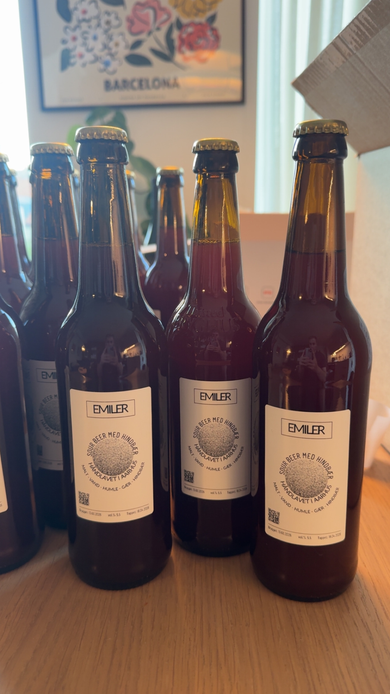

<html lang="da">
<head>
<meta charset="UTF-8">
<meta name="viewport" content="width=device-width, initial-scale=1.0">
<title>...</title>

</head>
<body>

<header>

EMILER

<nav>
<a href="#beer">Øl</a>
<a href="#about">Om</a>
</nav>
</header>

Hindre masseproduktion, mere smag

<h1>Håndlavet i Aarhus.</h1>

Af Emil Wiis Ravn og Emil Casper Rasmussen.

<a class="btn" href="#beer">Se batch 01</a>

<section id="beer">

Batch 01

<h2>Sour Beer med Hindbær</h2>

Den første officielle EMILER-øl. En frisk, syrlig og let frugtig sour,
hvor hindbær er i centrum. Brygget og flasket i Aarhus i 2026.

“Små mængder. Store ambitioner.”

<h3>Specifikationer</h3>

Stil<strong>Raspberry Sour</strong>

Alkohol<strong>5,5 %</strong>

Batch<strong>01</strong>

By<strong>Aarhus</strong>

Ingredienser<strong>Malt · Vand · Humle · Gær · Hindbær</strong>

</section>

<section id="about">

EMILER

<h2>Et lille bryggeri.</h2>

EMILER er et hobbybryggeri skabt af nysgerrighed og gode idéer.
Vi laver øl, vi selv har lyst til at drikke, og hver batch får sit eget udtryk.

</section>

<footer>
EMILER · HÅNDLAVET I AARHUS
RASPBERRY SOUR · BATCH 01
</footer>

</body>
</html>
